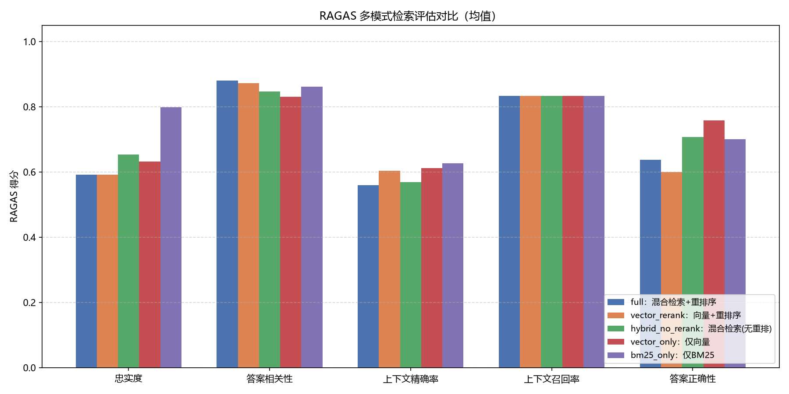

# AI 工作区 —  RAG 数据库智能问答系统

基于检索增强生成（RAG）的年报智能问答系统，含完整评估闭环与 Web API 服务。

## 目录结构

```
RAG_qa_system/
├── app/                     # ★ 应用/产品层（面向用户的集成入口）
│   ├── main.py              # 统一启动入口：python -m app.main
│   ├── api.py               # FastAPI 服务（/health /chat /chat/stream(SSE) /feedback）
│   ├── schemas.py           # API 请求/响应 Pydantic 模型（Literal/范围校验）
│   ├── qa_system.py         # QASystem 编排层（召回→重排→生成→引用）
│   ├── conversation.py      # ★ 多轮对话记忆（历史裁剪 + 检索查询改写）
│   ├── models.py / database.py  # SQLAlchemy ORM 与数据库
│   ├── config.py            # ★ 统一配置中心（路径/模型/端口，读 .env）
│   ├── cli.py               # 交互式 CLI 管线：解析 PDF → 切分 → 问答
│   └── streamlit_app.py     # Streamlit 前端：流式聊天 + 上传 + 历史
│
├── rag_system/              # 引擎层（可复用 RAG 组件库）
│   ├── parsing/             # PDF 解析与结构化切分
│   ├── splitting/           # 文本切分（递归 / 语义）
│   ├── retrieval/           # 混合检索（BM25 + Chroma + 融合 + 重排序）
│   ├── common/              # 统一日志 logging_config.py + 异常 exceptions.py
│   ├── evaluation/          # 评估（QA 对生成/审查、RAGAS 多模式评估）
│   ├── tests/               # 边界测试
│   ├── data/                # 数据文件（年报.pdf、结构化片段、评估数据集）
│   ├── chroma_db/           # Chroma 向量库持久化
│   └── logs/                # 运行日志
│
├── docs/                    # 文档与图表
│   └── eval_compare.png     # RAGAS 多模式评估对比图
│
├── scripts/                 # 开发辅助脚本
│   ├── smoke_test.py        # 包导入冒烟检查
│   ├── smoke_test_memory.py # 多轮记忆模块冒烟测试（不调真实 LLM）
│   ├── test_rerank_scoring.py # 重排打分纯函数测试（sigmoid 归一化 + 滑窗，14 项）
│   ├── verify_runtime.py    # 数据 + BM25 + 数据库功能验证
│   └── run_tests.py         # 运行边界测试
│
├── data/                    # SQLite 数据库（对话历史 / 反馈）
├── .streamlit/              # Streamlit 主题配置
│
├── requirements.txt         # 统一依赖清单
├── pyproject.toml           # 项目元数据与打包配置（pip install -e .）
├── docker-compose.yml       # 阿里云 ECS 一键部署编排
├── Dockerfile / .dockerignore
├── .env.example             # 环境变量示例
├── LICENSE
└── .env                     # 密钥与配置（deepseek_api_key 等，不入库）
```

## 快速开始

```bash
# 1. 安装依赖
pip install -r requirements.txt
# 可选：pip install -e .  让 app / rag_system 全局可导入

# 2. 配置 .env（仓库根目录）
# deepseek_api_key=your_deepseek_api_key
# 可选：LLM_MODEL=deepseek-chat、LLM_BASE_URL=https://api.deepseek.com/v1、LOG_LEVEL=INFO、API_PORT=8000

# 3. 启动 Web API
python -m app.main            # 等价于 uvicorn app.api:app --reload
# 接口文档：http://localhost:8000/docs

# 4. 或使用交互式 CLI 完整管线（解析→切分→问答）
python -m app.cli

# 5. 启动 Streamlit 前端（流式聊天 + 文件上传 + 历史记录）
streamlit run app/streamlit_app.py
# 访问：http://localhost:8501
```

## 常用命令

| 用途 | 命令 |
|------|------|
| 包导入冒烟检查 | `python scripts/smoke_test.py` |
| 多轮记忆模块测试 | `python scripts/smoke_test_memory.py` |
| ModelScope 预下载模型 | 容器内 `pip install -q modelscope -i https://mirrors.aliyun.com/pypi/simple/ && python scripts/download_models.py`（国内 ECS 专用，下载后离线加载） |
| 重排打分纯函数测试 | `python scripts/test_rerank_scoring.py`（sigmoid 归一化 + 滑窗切分，14 项） |
| 运行时功能验证 | `python scripts/verify_runtime.py` |
| 边界测试 | `python scripts/run_tests.py`（或 `python -m rag_system.tests.edge_case_test`） |
| 解析 PDF 年报 | `python -m rag_system.parsing.parse_pdf` |
| 切分对比实验 | `python -m rag_system.splitting.advanced_splitting` |
| 构建评估数据集 | `python -m rag_system.evaluation.generate_qa_pairs` → `review_qa_pairs` |
| RAGAS 多模式评估 | `python -m rag_system.evaluation.run_eval --compare` |
| 生成评估对比图 | `python -m rag_system.evaluation.plot_compare`（从 CSV 均值绘柱状图 → `docs/eval_compare.png`） |
| SSE 流式问答体验 | `curl -N -X POST http://localhost:8000/chat/stream -H "Content-Type: application/json" -d '{"query":"2025年净利润是多少"}'` |
| 容器化部署 | `docker build -t rag-workspace . && docker run -p 8000:8000 -e deepseek_api_key=xxx rag-workspace` |
| 启动 Streamlit 前端 | `streamlit run app/streamlit_app.py`（http://localhost:8501） |

## 多轮对话记忆

支持跨轮次的指代消解与省略补全（如「那净利润呢」→ 结合上一轮理解为「贵州茅台 2023 年净利润是多少」），核心在 `app/conversation.py`：

```
用户问题 ──┬─ 改写分支：LLM 结合历史改写为完整独立问题 ──→ 检索 + 重排序（召回更准）
           │
           └─ 生成分支：原始问题 + 历史消息注入 LLM messages ──→ 回答（自然承接上下文）
```

- **记忆裁剪**（`trim_history`）：双重上限——最近 `MAX_HISTORY_TURNS` 轮（默认 5）+ token 预算 `HISTORY_TOKEN_BUDGET`（默认 1500），超出从最旧丢弃，并剔除 sources/chat_id 等非 LLM 字段；
- **查询改写**（`rewrite_query`）：改写只用于检索，生成仍用原始问题（历史已注入，模型可自行消解指代）；改写调用失败/超时/结果异常时自动回退原始问题，**可用性优先**；
- **两路接入**：Streamlit 前端传入页面会话历史（`streamlit_app.py`）；API 侧 `/chat` 与 `/chat/stream` 按 `session_id` 从 ChatHistory 表加载最近 5 轮（1 轮 = 一问一答 = 2 行，`limit` 按行数取；不传 `session_id` 则保持单轮行为，向后兼容）；
- **成本**：每轮带历史的提问多一次改写调用（≤200 token、15s 超时）；历史 token 计入上下文预算，不会挤爆窗口。

验证：`python scripts/smoke_test_memory.py`（裁剪/降级/改写等 7 项，不调真实 LLM）。

## Web API 接口

| 方法 | 路径 | 说明 |
|------|------|------|
| GET | `/health` | 健康检查（含 RAG 初始化状态） |
| POST | `/chat` | 同步问答：完整 JSON 响应（answer + sources + chat_id）。同步 def 实现，FastAPI 自动放入线程池，LLM 长调用不阻塞事件循环 |
| POST | `/chat/stream` | **SSE 流式问答**：逐段推送答案增量，结束后推送引用来源与 chat_id，并自动落库 |
| POST | `/feedback` | 用户反馈落库（`feedback_type` 仅允许 `up`/`down`，`rating` 限 1~5） |

### SSE 事件协议（`/chat/stream`）

每帧均为 `data: {json}\n\n`：

| 事件 type | 载荷 | 说明 |
|------|------|------|
| `delta` | `{"content": "增量文本"}` | 答案增量（通常为 token 或小片段） |
| `sources` | `{"sources": [...]}` | 引用来源（title_path / 片段摘要 / rerank_score） |
| `done` | `{"chat_id": 123}` | 结束信号：答案已落库，chat_id 可用于反馈关联 |
| `error` | `{"detail": "..."}` | 中途异常（流内返回，HTTP 状态码仍为 200） |

```bash
# curl 体验（-N 禁用缓冲，逐帧可见）
curl -N -X POST http://localhost:8000/chat/stream \
  -H "Content-Type: application/json" \
  -d '{"query": "2025年净利润是多少", "session_id": "s1"}'
```

前端接入提示：浏览器原生 `EventSource` 只支持 GET，POST 场景用 `fetch` + ReadableStream 解析；Streamlit 侧则进程内直连 `stream_answer` + `st.write_stream`（`streamlit_app.py`）。响应已设置 `X-Accel-Buffering: no`，经 Nginx 反代也不会被缓冲。

## 技术栈

PDF 解析(Marker/PyMuPDF) · 文本切分(LangChain/语义) · BM25(jieba+rank_bm25) · 向量库(ChromaDB+BGE) · 重排序(BGE CrossEncoder，sigmoid 归一化 + 滑窗打分) · 多轮记忆(历史裁剪+查询改写) · LLM(DeepSeek) · API(FastAPI+SQLAlchemy+SSE 流式) · Web前端(Streamlit) · 评估(RAGAS) · 日志(logging RotatingFileHandler)

## RAGAS 评估对比

使用 [RAGAS](https://github.com/explodinggradients/ragas) 对 5 种检索模式进行了逐题评估与多模式对比（数据来源：`rag_system/data/eval_results_*.csv`）。

> **重排序打分修正与复跑验证（2026-09）**：逐变量消融实验曾定位到重排模块两个打分缺陷——**logit 未归一化**（BGE CrossEncoder 输出原始 logit ±10，`min_score` 阈值语义错误）与**长片段头部截断**（>512 token 只取前 500 字符打分，信息丢失致排序失真）。修复方案（`rag_system/retrieval/rerank.py`）：数值稳定 sigmoid 归一化到 [0,1]；500 字符滑窗（50 重叠、最多 8 窗）逐窗打分取最大值。纯函数测试：`python scripts/test_rerank_scoring.py`（14 项全通过）。
>
> **复跑结果（下表）结论反转**：full 模式 5 项指标全面提升，从"正确性垫底"反转为 3 项第一——忠实度 +0.12、上下文精确率 +0.23、答案正确性 +0.13；两个含重排的模式包揽全部 5 项最佳。修复前后对比（full 模式）：
>
> | 指标 | 修复前 | 修复后 | 变化 |
> |------|--------|--------|------|
> | 忠实度 | 0.5909 | **0.7069** | +0.116 |
> | 答案相关性 | 0.8804 | **0.9618** | +0.081 |
> | 上下文精确率 | 0.5593 | **0.7903** | +0.231 |
> | 上下文召回率 | 0.8333 | 0.8333 | — |
> | 答案正确性 | 0.6367 | **0.7637** | +0.127 |

**5 个评估指标**：忠实度（防幻觉）、答案相关性（切题）、上下文精确率（排序质量）、上下文召回率（召回完整性）、答案正确性（事实一致性）。



### 各模式指标均值（重排序修复后复跑，2026-09）

| 检索模式 | 忠实度 | 答案相关性 | 上下文精确率 | 上下文召回率 | 答案正确性 |
|----------|--------|-----------|-------------|-------------|-----------|
| full（混合检索+重排序） | **0.7069** | **0.9618** | **0.7903** | 0.8333 | 0.7637 |
| vector_rerank（向量+重排序） | 0.6657 | 0.9551 | 0.7407 | **0.9167** | **0.7910** |
| hybrid_no_rerank（混合检索，无重排） | 0.6478 | 0.8753 | 0.6583 | 0.8333 | 0.7529 |
| vector_only（仅向量） | 0.6181 | 0.8704 | 0.6528 | 0.8333 | 0.6887 |
| bm25_only（仅 BM25） | 0.7014 | 0.8861 | 0.6472 | 0.8333 | 0.6403 |

### 结论与建议

- **重排序价值得到验证**：两个含重排的模式（full / vector_rerank）包揽全部 5 项指标最佳——修复打分缺陷前重排是"负优化"（full 正确性 0.6367 垫底），修复后成为决定性增益（上下文精确率 0.79，比无重排模式高 0.13+）；
- **full 综合最优**：忠实度、答案相关性、上下文精确率 3 项第一，且相关性 0.9618 显著领先——混合召回保证"找得全"，重排保证"排得准"，两者缺一不可；
- **vector_rerank 的启示**：召回率 0.9167（唯一高于 0.83 的模式）与正确性 0.7910 均为最高，说明重排在纯语义召回上更聚焦；混合模式引入的 BM25 噪声略拉低正确性，但换来了忠实度与相关性——按场景权衡取舍；
- **BM25 定位**：忠实度 0.7014 仅次于 full（数值/术语类问答来源锁定准），但语义扩展能力弱（正确性 0.6403 最低），适合作为混合召回的互补通道而非独立方案；
- **工程结论**：默认 `retrieval_mode=full`；纯数值/术语问答可切 `vector_rerank`；生产调优优先保证重排打分语义正确（归一化 + 滑窗），这是本项目踩过的最深的坑。

## 阿里云部署（Docker Compose）

在单台阿里云 ECS 上使用 Docker Compose 一键部署（FastAPI 后端 + Streamlit 前端）。

```bash
# 1. 服务器安装 Docker + Compose 插件
# 2. 上传项目源码到服务器（.env 含密钥，不要上传，在服务器上单独创建）
# 3. 配置环境变量
cp .env.example .env
#    编辑 .env，填入 deepseek_api_key
# 4. 构建并启动
docker compose up -d --build
# 5. 查看状态与日志
docker compose ps
docker compose logs -f rag-api
```

- 后端 API 文档：`http://<服务器IP>:8000/docs`
- 前端页面：`http://<服务器IP>:8501`

### 配置说明

| 项 | 说明 |
|----|------|
| `deepseek_api_key` | 必填，DeepSeek API 密钥（[平台](https://platform.deepseek.com/)） |
| `HF_ENDPOINT` | 默认 `https://hf-mirror.com`。国内 ECS 无法直连 HuggingFace，BGE 嵌入/重排模型从该镜像站下载 |
| `HF_HUB_OFFLINE` / `TRANSFORMERS_OFFLINE` | 默认 `1`：模型从 `hf_cache` 本地缓存离线加载，冷启动不依赖 hf-mirror（曾因镜像站抖动导致初始化卡死）。换新模型时临时设 `0`，并先跑 ModelScope 下载脚本 |
| `MAX_HISTORY_TURNS` | 可选，多轮记忆保留轮数（默认 5，1 轮 = 一问一答） |
| `HISTORY_TOKEN_BUDGET` | 可选，历史注入 LLM 的 token 预算（默认 1500，超出丢最旧） |
| 数据卷 | rag-api / rag-web 各自独立挂载 data、chroma_db、SQLite、logs（避免 ChromaDB/SQLite 并发写锁冲突）；`hf_cache` 卷共享模型缓存 |
| 首启时间 | 首次启动需下载 BGE 模型并重建索引，约 3~10 分钟，健康检查 `start-period=300s` 已覆盖 |

### 阿里云 ECS 注意事项

- **安全组**放行 8000 / 8501 端口（生产建议前面加 Nginx / SLB 只暴露 443，或仅内网访问）。
- 建议 **2 核 4GB 以上**：BGE 重排模型（bge-reranker-base 约 1.1GB）+ 嵌入模型加载约需 1.5GB 内存。
- 若需公网 HTTPS 域名：使用阿里云 SLB/ALB + SSL 证书，转发到 8000 / 8501。
- **默认单 worker**：本应用每个 worker 都会独立加载模型并重建 Chroma 索引，多 worker 会内存翻倍并引发锁冲突。若要扩展，建议先将 Chroma 迁移为 Server 模式、SQLite 迁移为 RDS PostgreSQL（代码已支持 `DATABASE_URL` 非 SQLite 分支）。
- 数据持久化在命名卷中，`docker compose down` 不会删除；确认清理用 `docker compose down -v`。
- 更新知识库数据：`docker compose cp rag_system/data/structured_segments.json rag-api:/workspace/rag_system/data/` 后重启容器（启动时会自动重建索引）。

## 下一步规划

- ~~流式 SSE 接口（FastAPI 侧）~~ ✅ 已完成：`POST /chat/stream`（delta/sources/done/error 四类事件，流结束自动落库）
- ~~重排序修复后复跑 RAGAS 评估~~ ✅ 已完成（2026-09）：full 模式 3 项指标第一，重排价值得到验证，对比表与 `docs/eval_compare.png` 已更新
- SSE 并发安全：`last_sources` 改为随流返回（当前单实例安全）；检索/重排迁移 `run_in_executor` 或 AsyncOpenAI
- 鉴权与限流、向量库增量复用、多文档管理
- pytest 化 + CI、Alembic 迁移、监控指标、评估闭环回灌
- 记忆增强：对话摘要压缩（超长历史蒸馏为摘要）、按 session 的向量记忆库
